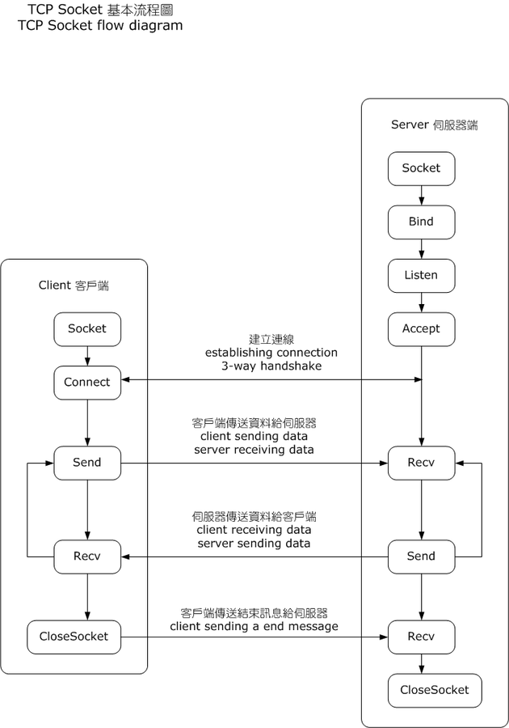

# Primitive HTTP Server in Python using TCP sockets

Source of the code and explanations: [Real Python](https://realpython.com/python-sockets/)



## Basic Python Client/Server Using sockets

Server

```python
import socket

HOST = '127.0.0.1'
PORT = 5000

with socket.socket(family=socket.AF_INET, type=socket.SOCK_STREAM) as s:
    s.bind((HOST, PORT))
    s.listen()
    conn, addr = s.accept()
    with conn:
        print(f"Got connection from {addr}")
        while True:
            data = conn.recv(1024)
            if not data:
                break
            conn.sendall(data)
```

Client

```python
import socket

HOST, PORT = '127.0.0.1', 5000

with socket.socket(socket.AF_INET, socket.SOCK_STREAM) as s:
    s.connect((HOST, PORT))
    s.sendall(b"Hello World")
    data = s.recv(1024)

print("Received response from server: {}".format(data.decode()))
```

- `socket.AF_INET` - IPv4 IP Address Family
- `socket.SOCK_STREAM` - TCP protocol

What Server Does:

create socket -> bind -> listen -> accept -> recv -> send -> close

What Client Does:

create socket -> connect -> send -> recv -> close

>**NOTE:** `s.accept()` is blocking, so the program just hangs on this line until a client connects.

Running both scripts:

Server Shell:

```bash
Got connection from ('127.0.0.1', 60516)
```

`60516` in the output above is the TCP port number of the client.

Client Shell:

```bash
Received response from server: Hello World
```

## Handling multiple connections

There is a big limitation. When the client uses `s.recv()`, it's possible that it will return only one byte, `b'H'` from `b'Hello, world'`:

```python
...
data = s.recv(1024)
...
```

The `bufsize` argument of 1024 used above is the maximum amount of data to be received at once. It doesn’t mean that .recv() will return 1024 bytes.

The `.send()` method also behaves this way. It returns the number of bytes sent, which may be less than the size of the data passed in. You’re responsible for checking this and calling .send() as many times as needed to send all of the data.

In the example above, this was avoided by using .sendall():

> "Unlike send(), this method continues to send data from bytes until either all data has been sent or an error occurs. None is returned on success."

The above implementations of client and server have 2 limitations:

- They do not handle multiple connections concurrently
- `.send()` and `.recv()` need to be called until all the data is sent or received

For handling multiple connections, concurrency can be used. It can be handled using Asyncio, Multithreading, Multiprocessing.

The below examples will not use the concurrency, though. `selectors` and `.select()` will be used for that.

The `.select()` method allows to check for I/O completion on more than one socket. So `.select()` can be called to see which sockets have I/O ready for reading and/or writing.

## Multi-Connection Client and Server

> **NOTE:** `.recv()` is like reading from a file and `.send()` is like writing to a file.

Multi-Connection Server Code(Read Comments):

```python
#!/usr/bin/python3

import selectors
import socket
import sys
import types

# NOTE recv() is like reading from a file and send() is like writing to a file
 
sel = selectors.DefaultSelector()

def accept_wrapper(sock: socket.socket) -> None:
    """ Function for accepting and registering client connections in selector """
    # here sock will be our listening socket
    conn, addr = sock.accept() # 7A-1. Accept connections. conn now represents one of the client sockets
    print(f"Accepted connection from: {addr}")
    conn.setblocking(False) # 7A-2. Set client socket to be non-blocking
    data = types.SimpleNamespace(addr=addr, inb=b"", outb=b"") # 7A-3. Create "data" object to be stored beside new client socket
    events = selectors.EVENT_READ | selectors.EVENT_WRITE # 7A-4. Set events to be stored beside new client socket
    sel.register(conn, events, data=data) # 7A-5. Register client socket with selector
    # sel.register returns selectors.SelectorKey(fileobj, events, data)


def service_connection(key: selectors.SelectorKey, mask: selectors.EVENT_READ | selectors.EVENT_WRITE):
    """ Function for serving and closing client connections """
    sock: socket.socket = key.fileobj #7B-1. Get socket object from SelectorKey object
    # this socket is the socket we registered in accept_wrapper method
    data: types.SimpleNamespace = key.data #7B-2. Get data from SelectorKey object
    if mask & selectors.EVENT_READ: #7B-3A.
        # 7B-3A-1. If the client socket is ready to be read from - recv data from it
        recv_data = sock.recv(1024) # Should be ready to read
        if recv_data:
            # 7B-3A-2A. Is there is still data sent by the client - add it to the data that the server will send back to the client
            data.outb += recv_data
        else:
            # 7B-3A-2B. If all the data was received from the client - unregister the client socket from selector
            # and close this socket
            print(f"Closing connection to {data.addr}")
            sel.unregister(sock)
            sock.close()
    if mask & selectors.EVENT_WRITE: #7B-3B. If the client socket is ready to be written to - send data to it
        if data.outb:
            print(f"Echoing {data.outb!r} to {data.addr}")
            sent = sock.send(data.outb) # Should be ready to write
            data.outb = data.outb[sent:]


if len(sys.argv) != 3:
    print(f"Usage: {sys.argv[0]} <host> <port>")
    sys.exit(1)

host, port = sys.argv[1], int(sys.argv[2])
lsock = socket.socket(socket.AF_INET, socket.SOCK_STREAM) # 1. Create listening socket
lsock.bind((host, port)) # 2. Bind it to host:port
lsock.listen() # 3. Set it into listening mode
print(f"Listening on {(host, port)}")
lsock.setblocking(False) # 4. Make it non-blocking
sel.register(lsock, selectors.EVENT_READ, data=None) # 5. Register listening socket with selector
# EVENT_READ means that the file object(socket in this case) is ready to be read from or that it is ready to 
# accept connections - it is the listening socket

try:
    while True:
        events: list[tuple[selectors.SelectorKey, selectors.EVENT_READ | selectors.EVENT_WRITE]] = sel.select(timeout=None) # 6. Select file descriptors that are ready for I/O operations
        # sel.select is blocking with timeout=None until there are ready file objects
        # if timeout <= 0 - it won't block and return the currently ready file objects
        # if timeout > 0 it will block for maximum time in seconds
        for key, mask in events:
            # key stores fileobj(socket), events, data
            # Our listening socket has data set to None and also on the first iteration
            # it is the only registered socket, so we call accept_wrapper
            if key.data is None:
                accept_wrapper(key.fileobj) # 7A. Accept connection if the socket is listening
            else:
                service_connection(key, mask) # 7B. Serve connection if it is the client socket
except KeyboardInterrupt:
    print("Caught keyboard interrupt, exiting...")
finally:
    sel.close() # we do not close lsock manually, but maybe sel.close does it ???
```

Client Code:

```python
#!/usr/bin/python3

import selectors
import socket
import sys
import types

sel = selectors.DefaultSelector()
messages: list[bytes] = [b"Message 1 from client.", b"Message 2 from client."]

def start_connections(host: str, port: int, num_conns: int) -> None:
    server_addr = (host, port)
    for i in range(num_conns):
        connid = i + 1
        print(f"Starting connection {connid} to {server_addr}")
        sock = socket.socket(socket.AF_INET, socket.SOCK_STREAM)
        sock.setblocking(False)
        sock.connect_ex(server_addr) # .connect_ex is used instead of .connect, because
        # .connect would immediately raise BlockingIOError. 
        # The .connect_ex() method initially returns an error indicator, errno.EINPROGRESS, 
        # instead of raising an exception that would interfere with the connection in progress. 
        # Once the connection is completed, the socket is ready for reading and writing 
        # and is returned by .select().
        events = selectors.EVENT_READ | selectors.EVENT_WRITE
        data = types.SimpleNamespace(
            connid=connid,
            msg_total=sum(len(m) for m in messages),
            recv_total=0,
            messages=messages.copy(),
            outb=b""
        )
        # After the socket is set up, the data to store with the socket is created using SimpleNamespace.
        #  The messages that the client will send to the server are copied using messages.copy()
        #  because each connection will call socket.send() and modify the list. 
        # Everything needed to keep track of what the client needs to send, has sent, and has received, 
        # including the total number of bytes in the messages, is stored in the object data.
        sel.register(sock, events, data=data)

def service_connection(key: selectors.SelectorKey, mask: selectors.EVENT_READ | selectors.EVENT_WRITE) -> None:
    sock: socket.socket = key.fileobj
    data = key.data
    if mask & selectors.EVENT_READ:
        recv_data = sock.recv(1024)
        if recv_data:
            print(f"Received {recv_data!r} from connection {data.connid}")
            data.recv_total += len(recv_data)
        if not recv_data or data.recv_total == data.msg_total:
            print(f"Closing connection {data.connid}")
            sel.unregister(sock)
            sock.close()
    if mask & selectors.EVENT_WRITE:
        if not data.outb and data.messages:
            data.outb = data.messages.pop(0)
        if data.outb:
            print(f"Sending {data.outb!r} to connection {data.connid}")
            sent = sock.send(data.outb)
            data.outb = data.outb[sent:]


if len(sys.argv) != 4:
    print(f"Usage: {sys.argv[0]} <host> <port> <num_connections>")
    sys.exit(1)


host, port, num_conns = sys.argv[1:4]
start_connections(host, int(port), int(num_conns)) # 1. Create num_conns client sockets and register them with selector

try:
    while True:
        events: list[tuple[selectors.SelectorKey, selectors.EVENT_READ | selectors.EVENT_WRITE]] = sel.select(timeout=1)
        # 2. Wait for fileobjects to be ready for I/O
        if events:
            for key, mask in events:
                service_connection(key, mask) # 3. Serve client sockets
        # Check for a socket being monitored to continue.
        if not sel.get_map():
            break
except KeyboardInterrupt:
    print("Caught KeyboardInterrupt, exiting")
finally:
    sel.close()
```

Server and Client are fundamentally the same, but with one important difference. The client keeps track of the number of bytes it’s received from the server so that it can close its side of the connection. When the server detects this, it closes its side of the connection too.

Note that by doing this, the server depends on the client being well-behaved: the server expects the client to close its side of the connection when it’s done sending messages. If the client doesn’t close, the server will leave the connection open. In a real application, you may want to guard against this in your server by implementing a timeout to prevent client connections from accumulating if they don’t send a request after a certain amount of time.

### Running Client Server

server terminal:

```bash
$ python multiconn-server.py 127.0.0.1 65432
Listening on ('127.0.0.1', 65432)
Accepted connection from ('127.0.0.1', 61354)
Accepted connection from ('127.0.0.1', 61355)
Echoing b'Message 1 from client.Message 2 from client.' to ('127.0.0.1', 61354)
Echoing b'Message 1 from client.Message 2 from client.' to ('127.0.0.1', 61355)
Closing connection to ('127.0.0.1', 61354)
Closing connection to ('127.0.0.1', 61355)
```

client terminal:

```bash
$ python multiconn-client.py 127.0.0.1 65432 2
Starting connection 1 to ('127.0.0.1', 65432)
Starting connection 2 to ('127.0.0.1', 65432)
Sending b'Message 1 from client.' to connection 1
Sending b'Message 2 from client.' to connection 1
Sending b'Message 1 from client.' to connection 2
Sending b'Message 2 from client.' to connection 2
Received b'Message 1 from client.Message 2 from client.' from connection 1
Closing connection 1
Received b'Message 1 from client.Message 2 from client.' from connection 2
Closing connection 2
```

## Application Client and Server

Multi-Connection Client and Server have some problems:

- Exceptions are not handled
- Server doesn't really know how much bytes it should read from the socket. For this application-layer protocol should be defined and both server and client should follow this protocol. The approach used by HTTP protocol will be used. Messages will be prefixed with the **header** that would contain the information about the length of the incoming data, so that the server can call `.recv()` as many times as needed until the whole message is read.

## Application Protocol Header

The protocol header is:

- Variable-Length Text
- Unicode with the encoding UTF-8
- JSON serialized Python dictionary

The contents of the protocol header's dictionary:

- `byteorder`: The byte order of the machine (uses `sys.byteorder`). This may not be required.

- `content-length`: The length of the content in bytes.

- `content-type`: The type of content in the payload, for example, text/json or binary/my-binary-type.

- `content-encoding`: The encoding used by the content, for example, utf-8 for Unicode text or binary for binary data.

## Application Message

We'll prefix a variable-length JSON header with a fixed-length 2-byte header that contains the length of the JSON header.

How it looks like:

______________
    Fixed-Length Header:
   - Type: 2-byte integer
   - Byte Order: network(big-endian)
______________

______________
    Variable-Length JSON Header:
   - Type: Unicode Text
   - Encoding: UTF-8
   - Length: specified by fixed-length header 
______________

______________
    Variable-Length Content:
   - Type: Specified in JSON header
   - Encoding: Specified in JSON header
   - Length: Specified in JSON header
______________
